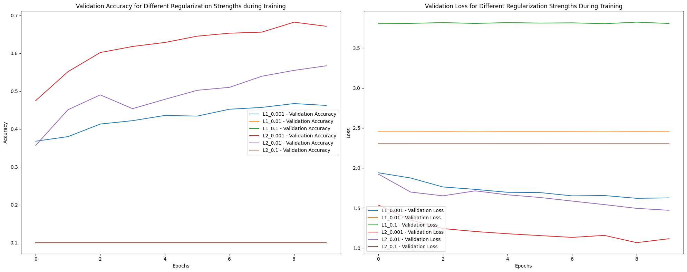

# Overfitting and Underfitting with Regularization on CIFAR-10

## Overview

This repository explores the effects of regularization techniques on a Convolutional Neural Network (CNN) trained on the CIFAR-10 dataset. The focus is on understanding how L1 and L2 regularization impact model performance, specifically looking at overfitting and underfitting.

## Objectives

- Implement a CNN for image classification on the CIFAR-10 dataset.
- Apply L1 and L2 regularization with various strengths.
- Analyze the impact of regularization on overfitting and underfitting.
- Determine the optimal regularization strength based on model performance.

## Requirements

- Python 3.x
- TensorFlow 2.x
- Matplotlib
- Seaborn
- Pandas

## Dataset

The CIFAR-10 dataset is used, which consists of 60,000 32x32 color images in 10 classes, with 6,000 images per class.

## Model Architecture

The CNN model includes:
- 3 Convolutional layers with ReLU activation.
- MaxPooling layers after each convolutional layer.
- Flatten and Dense layers.
- Regularization applied to convolutional and dense layers.

## Regularization

The following regularization strengths were evaluated:
- L1 Regularization: 0.001, 0.01, 0.1
- L2 Regularization: 0.001, 0.01, 0.1

## Results

### 1. Accuracy and Loss During Training

This plot shows the training and validation accuracy and loss over epochs for different regularization strengths.



### 2. Accuracy and Loss at Evaluation

This plot compares the final evaluation accuracy and loss for each regularization strength.


### 3. Comparing Training accuracy and loss with evaluation accuracy and loss to get insight on overfitting and underfitting
This plot compares the training and evaluation accuracy and loss for each regularization strength.


## Implementation

1. **Data Preparation**: Load and preprocess CIFAR-10 dataset.
2. **Model Creation**: Define the CNN architecture with optional L1 or L2 regularization.
3. **Training**: Train the model with various regularization strengths.
4. **Evaluation**: Assess model performance on the test set.
5. **Analysis**: Compare the effects of different regularization strengths on overfitting and underfitting.

## Usage

Clone this repository and run the `main.py` script to replicate the results:

```bash
git clone https://github.com/AryanMithbawkar/Overfitting-and-Underfitting-with-Regularization-on-CIFAR-10.git
cd Overfitting-and-Underfitting-with-Regularization-on-CIFAR-10
CIFAR-10.ipynb
```
## Contribution
Feel free to fork this repository and submit pull requests for improvements or additional analyses.

## License
This project is licensed under the MIT License - see the LICENSE file for details.

## Acknowledgments
- CIFAR-10 dataset: [CIFAR-10 Dataset](https://www.tensorflow.org/datasets/catalog/cifar10)
- TensorFlow and Keras documentation for model and regularization implementation.
